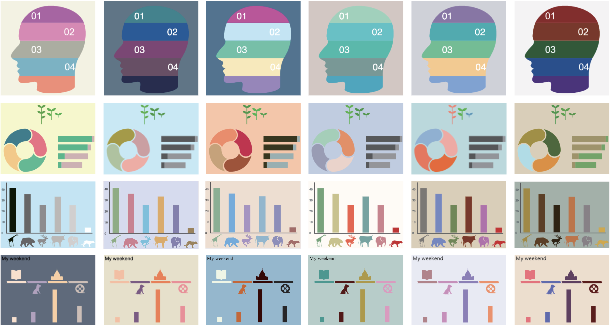

# InfoColorizer: Interactive Recommendation of Color Palettes for Infographics


This repository contains code and study materials for the paper _InfoColorizer: Interactive Recommendation of Color Palettes for Infographics,_ contributed by Lin-Ping Yuan, Ziqi Zhou, Jian Zhao, Yiqiu Guo, Fan Du, and Huamin Qu. The paper can be found [here](https://arxiv.org/pdf/2102.02041.pdf). All rights reserved by authors.

----
## Introduction
InfoColorizer is a tool that allows users to effectively obtain high-quality color palettes during infographics creation. 
It consists of a recommendation engine and a visual interface.
From a large infographic dataset, we extract a set of features that embeds both structure and color information of infographics (the red arrow). 
We then train a deep learning model, VAEAC, that characterizes good color design practices in the data, to construct our recommendation engine. 
With the visual interface, users can obtain recommended color palettes, specify various color preferences and constraints, preview and edit infographics, 
and retrieve new recommendations in an iterative manner (the blue arrows). 


## Supplementary Materials 
- [Demo Video](https://youtu.be/FZvLt0AAIAI)
- [Appendices](assets/infocolorizer_appendix.pdf)
- [Results generated by participants in the controlled user study and expert interview](https://bit.ly/38zinpV)
```
## Recommended Palettes Examples 


```
## Feature Extraction Algorithm
As described in [Section 5.1.1](https://arxiv.org/pdf/2102.02041.pdf), we extract features at different levels and construct a tree that captures spatial relationship of infographic elements. The corresponding code is mainly at [./backend/treeconstructor](backend/treeconstructor).


## Deployment
### Prerequisite:
[Node](https://nodejs.org/) and [Python](https://www.python.org/)
### Environment
- Vue 3.6.3
- python 3.6
### Setup the interface 

```
- cd frontend
- npm install
- npm run serve
```

### Start the server 
```
- cd backend
- pip install -r requirements.txt (suggest using virtual environment https://docs.python.org/3/tutorial/venv.html)
- bash run-data-backend.sh
```
## Cite this work
```
@article{yuan2021infocolorizer,
  title={InfoColorizer: Interactive Recommendation of Color Palettes for Infographics},
  author={Yuan, Lin-Ping and Zhou, Ziqi and Zhao, Jian and Guo, Yiqiu and Du, Fan and Qu, Huamin},
  journal={arXiv preprint arXiv:2102.02041},
  year={2021}
}
```
